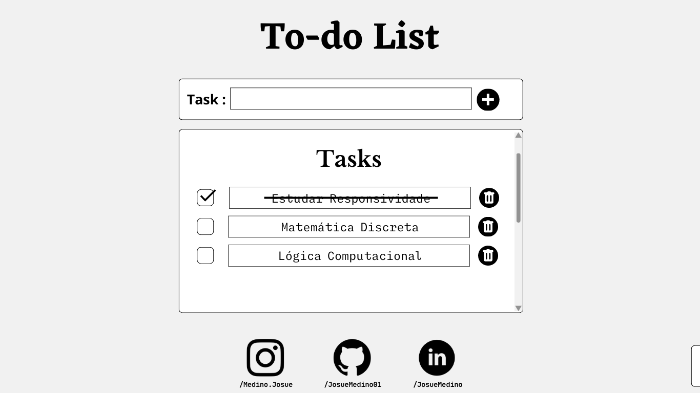

<h1>Project To do List</h1>

<h3>Gerenciamento  de Dados</h3>

Para o gerenciamento das informações, fui utilizada a API localStorage,
onde os dados são armazenados no próprio navegador do usuário, possiblitiando
que as tarefas sejam salvas e dando ao usuário a liberdade de exluir-las no momento
em que for nescessário. Além de também ter usado esse método para verificar quais
tarefas foram terminadas na ultima vez que a página foi usada.

<h3>Modularização do Código</h3>

Através da modularização do código, foi possível melhorar de forma objetiva 
a organização do código, isso foi muito útil para encontrar alguns bugs que o algorítimo 
apresentava, além de esteticamente melhor de visualizar o que cada trecho do código faz,
tornando prático a implementação de novas Features e a correção de Bugs.

<h3>Criação Dinâmica dos Elementos HTML</h3>

Neste projeto usei bastante Javascript para a criação de elementos HTML, uma vez que 
em uma lista de tarefas é preciso que o usuário especifique as tasks o que faz nescessário a
criação dinâmica de elementos. Foi usada tabelas para organização, onde a primeira coluna 
se refere aos checkboxes, a segunda para as tarefas propriamente ditas, e a terceira para a
exlusão das tarefas. Todas as linhas são criadas e excluidas dinamicamentes, o que permite 
grande interatividade do usuário.

<h3>Responsividade</h3>

Foi usado o @media para deixar o site responsivo para aparelhos mobile, ou seja, a partir do 
da largura da tela do usuário, é usada uma configuração CSS que se adeque aquele tipo de aparelho, 
evitando rolagens laterais, tamanhos de textos e  imagens desproporcionais.

<h3>Contato</h3>
<a href="https://www.instagram.com/medino.josue/">LinkedIn</a>
<a href="https://www.linkedin.com/in/josu%C3%A9-medino-da-silva-149077227/">Instagram</a>

